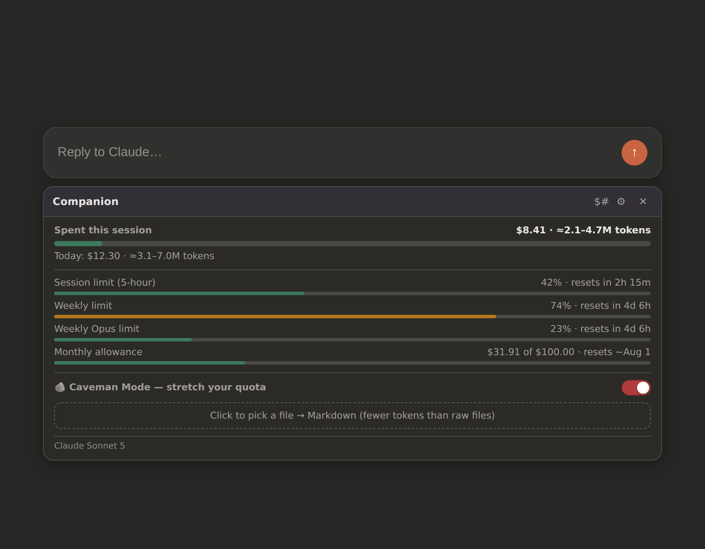

<div align="center">


<h1>COMPANION</h1>

<h3>Private usage and efficiency tools for Claude and ChatGPT</h3>

<p><strong>Native numbers or nothing. Local transformations or nothing.</strong> See provider-reported usage when it is available, use Lifejacket Mode to reduce avoidable prompt and reply tokens, and keep prompts, replies, files, and history private.</p>

<p>
  
  
  
</p>

<p>
  <a href="#install-and-test">Install and test</a> ·
  <a href="docs/LIFEJACKET_MODE.md">Lifejacket Mode</a> ·
  <a href="docs/SECURITY.md">Security</a> ·
  <a href="store/privacy-policy.md">Privacy policy</a> ·
  <a href="RELEASE_NOTES_1.4.0.md">Release notes</a>
</p>


<sub>The Chrome Web Store URL will be added after v1.4.0 completes review. Release artifacts are built and tested from pinned inputs.</sub>

</div>

---

## What COMPANION does

COMPANION is a Chrome Manifest V3 extension for supported Claude and ChatGPT web surfaces. It combines two deliberately separate jobs:

1. show native provider usage data when the provider exposes trustworthy numeric fields;
2. provide local, user-controlled efficiency tools beside the active composer.

It does not fill missing provider data with a confident-looking estimate.

> **Show a native value when the provider exposes it. Say when it does not. Never turn a guess into a fact.**

## Supported surfaces

| Surface | Behavior |
| --- | --- |
| **Claude.ai** | Native usage-credit spend, rolling session and weekly limits, Opus usage when reported, reset times, local history, pace warnings, and Lifejacket Mode. |
| **ChatGPT Chat** | Provider-native widget styling, supported numeric usage fields OpenAI exposes to the page, freshness labels, and Lifejacket Mode. |
| **ChatGPT Work** | Restrained Work context styling, supported shared agentic usage when available, and Lifejacket Mode. |
| **Codex-aware ChatGPT web routes** | Graphite and indigo context styling, supported shared agentic usage when available, and Lifejacket Mode. |

The native Codex desktop application is not a Chrome extension host. COMPANION supports Codex-aware web surfaces inside ChatGPT, not the desktop shell.

## Lifejacket Mode

Lifejacket is an optional master mode with three independent child controls.

### 1. Shorten the user's prompt

When enabled, every supported non-empty send invokes a bundled MobileBERT LLMLingua-2-style Q8 token classifier locally through CPU/WASM.

The release model is built from a pinned 99,170,493-byte FP32 checkpoint into a measured 40,312,452-byte Q8 package using per-channel QUInt8 quantization plus selective FP16-preserved weights. Model weights, tokenizer files, the browser runtime, checksums, and license notices ship inside the extension. Nothing is downloaded at runtime.

Before accepting a result, Lifejacket protects code, URLs, email addresses, quotations, numbers, structured rows, negation, obligations, and bounds. It falls back to the original when:

- protected content disappears or changes order;
- the candidate becomes larger;
- more than 60% of non-whitespace content would be removed;
- tokenizer coverage is poor;
- model loading, inference, or validation fails.

Every intercepted send opens an editable preview:

- **Send optimized**
- **Send original**
- **Cancel**

Nothing is silently submitted.

### 2. Ask for shorter answers

This separate control appends one visible instruction to the end of the final prompt:

> Reply briefly. Lead with the answer and keep every necessary fact, step, and caveat.

Prompt compression can be off while reply brevity remains on.

### 3. Convert files to Markdown

Lifejacket converts supported PDF, Office, OpenDocument, RTF, CSV, HTML, Markdown, and text files locally. Markdown and text are read directly. Other formats are parsed in a manifest-declared opaque-origin sandbox with no network access, extension API access, provider session access, or persistent file storage.

Converted Markdown is appended to the current draft. Files are limited to 20 MB and inserted text to 800,000 characters. Optical Character Recognition is not included.

Read the full **[Lifejacket architecture and safety boundaries](docs/LIFEJACKET_MODE.md)**.

## What it looks like

### Claude usage and history


### Privacy-first settings


### Dark composer integration



## Privacy is an architecture decision

COMPANION has:

- no COMPANION account;
- no developer backend;
- no analytics or telemetry;
- no advertising or trackers;
- no remote code;
- no runtime model downloads;
- no remote fonts;
- no broad `<all_urls>` permission;
- no broad `tabs` permission;
- no prompt or reply storage;
- no raw OpenAI response storage;
- no file upload to a COMPANION service.

### Claude boundary

Claude usage reads are read-only and same-origin. The browser authenticates them using the existing signed-in session. COMPANION never reads or stores the session cookie.

### OpenAI boundary

Raw first-party ChatGPT responses stay in the page world. A random per-page channel carries only normalized JSON containing recognized bounded numeric fields. The isolated content script validates it, and the service worker validates sender, frame, origin, keys, units, bucket names, timestamps, ranges, and payload size again.

### Lifejacket boundary

Prompt text crosses only internal extension boundaries required for local offscreen inference. Privileged routes accept messages only from the extension's own top-frame content scripts on allowed Claude or ChatGPT origins. The model runs locally. The provider receives only the prompt the user explicitly chooses to send.

### File boundary

Untrusted document bytes are parsed inside an opaque-origin sandbox. The privileged offscreen page relays bytes in and Markdown out. The sandbox cannot access extension storage, provider sessions, network endpoints, or Chrome APIs.

### Shared badge boundary

Claude and OpenAI keep separate usage adapters but share one browser toolbar badge. A serialized owner prevents stale provider state from clearing a newer provider warning.

Read **[Security and Privacy](docs/SECURITY.md)** and the public **[Chrome Web Store privacy policy](store/privacy-policy.md)**.

## Data flow

```text
Claude native usage endpoints
        │ read-only, same-origin
        ▼
Claude adapter ─────────────► local widget, popup, history, alerts

ChatGPT first-party response
        │ normalize bounded numeric fields in page world
        ▼
random per-page channel
        │ validate again
        ▼
OpenAI adapter ─────────────► local widget, popup, freshness, alerts

user presses Send with Lifejacket enabled
        │ protect sensitive spans
        ▼
validated service-worker route
        │ local offscreen Q8/WASM inference
        ▼
editable preview ───────────► optimized, original, or cancel

user-selected file
        │ explicit action
        ▼
opaque-origin parser sandbox ──► Markdown preview/composer
```

## Install and test

### Chrome Web Store

The public Chrome Web Store link will be inserted after v1.4.0 review and final smoke testing.

### Verified release candidate

Use the artifact produced by the `release-package` GitHub Actions workflow. It contains:

- the tested Chrome Web Store ZIP;
- SHA-256 checksum;
- package inventory;
- CycloneDX SBOM;
- model provenance and checksums;
- Q8 fidelity and latency report;
- test transcript;
- release notes.

1. Download and extract `companion-1.4.0.zip`.
2. Open `chrome://extensions`.
3. Enable **Developer mode**.
4. Choose **Load unpacked**.
5. Select the extracted directory containing `manifest.json`.
6. Open or reload Claude.ai or ChatGPT.com.

### Build from source

Requirements:

- Node.js 22 or newer;
- Python 3.12 recommended;
- the pinned packages in `requirements-lifejacket-build.txt`.

```bash
git clone https://github.com/zgbrenner/companion.git
cd companion
npm ci --ignore-scripts
python3 -m pip install -r requirements-lifejacket-build.txt
npm run build:lifejacket
npx playwright install chromium
node tests/run.mjs
bash tools/package-webstore.sh
```

The deterministic package is written to:

```text
dist/companion-1.4.0.zip
```

A SHA-256 checksum and file-by-file inventory are written beside it.

## Release verification

The committed suite covers:

- extension boot and settings persistence;
- Claude and OpenAI popup rendering;
- Lifejacket settings migration and independent controls;
- real composer interception on Claude and ChatGPT-style surfaces;
- visible optimized/original/cancel behavior;
- protected-span, negation, and low-language-coverage fallback;
- local sandboxed document conversion;
- accessibility audits;
- provider and surface detection;
- least-privilege manifest rules;
- OpenAI normalization, query stripping, and forgery resistance;
- usage freshness and expiry;
- provider-aware popup routing;
- complete local-data clearing;
- badge ownership, restart reconciliation, and single-writer enforcement;
- deterministic model and runtime builds;
- Q8-to-FP32 fidelity, ranking, probability-drift, size, and latency gates;
- deterministic release ZIP reproduction;
- CodeQL, dependency, secret, and package-surface scans;
- SBOM and provenance generation.

## Documentation

| Document | Purpose |
| --- | --- |
| **[Quick Start](docs/QUICKSTART.md)** | Installation, everyday use, and troubleshooting |
| **[Lifejacket Mode](docs/LIFEJACKET_MODE.md)** | Model selection, local inference, safeguards, and limitations |
| **[OpenAI Support](docs/OPENAI_SUPPORT.md)** | Chat, Work, Codex-aware behavior, usage semantics, and limitations |
| **[Security and Privacy](docs/SECURITY.md)** | Permissions, data flow, threat model, and audit steps |
| **[Privacy Policy](store/privacy-policy.md)** | Public Chrome Web Store privacy policy |
| **[Release Notes](RELEASE_NOTES_1.4.0.md)** | v1.4.0 changes and upgrade behavior |
| **[Changelog](CHANGELOG.md)** | Version history |
| **[Contributing](CONTRIBUTING.md)** | Development and review guidance |

## Accuracy boundaries

### Usage data

Claude dollar values come from Claude's native usage-credit counter. Session and history values are deltas from that counter. Token figures are derived ranges, not exact counts. OpenAI exposes different account data by plan and surface; COMPANION renders only recognized native numeric fields.

### Compression

Prompt compression is lossy. Protected spans, coverage checks, conservative retention, and user review reduce risk but cannot prove semantic identity. Send the original whenever the optimized prompt removes necessary meaning.

### Provider changes

Claude and ChatGPT are web applications. Their internal layouts and response shapes can change. COMPANION fails closed by omitting unsupported usage rows and retaining the original prompt when a transformation cannot be validated.

## Support and contribution

Use GitHub Issues for reproducible bugs and feature requests. For security-sensitive reports, contact `zgbrenner@gmail.com` without including passwords, session cookies, account tokens, private prompts, or private files.

## FAQ

<details>
<summary><strong>Does COMPANION send prompts, files, or model inputs to the developer?</strong></summary>
<br>
No. There is no COMPANION backend. Lifejacket inference and file conversion run locally. Prompt text is not stored. The provider receives only the prompt you choose to send.
</details>

<details>
<summary><strong>Does Lifejacket always make a prompt shorter?</strong></summary>
<br>
No. It always invokes the local model when prompt compression is enabled, but it returns the original when compression is unsafe, ineffective, or poorly supported by the tokenizer.
</details>

<details>
<summary><strong>Why is ChatGPT usage blank?</strong></summary>
<br>
OpenAI may expose no supported native counter to that account or surface. COMPANION leaves the state blank rather than estimating a quota.
</details>

<details>
<summary><strong>Does it work inside the native Codex desktop app?</strong></summary>
<br>
No. The native desktop shell is not a Chrome extension host. COMPANION supports Codex-aware ChatGPT web surfaces.
</details>

<details>
<summary><strong>Is COMPANION affiliated with Anthropic, OpenAI, Microsoft, Hugging Face, or the model author?</strong></summary>
<br>
No. COMPANION is independent and unofficial. Product and model names remain the property of their respective owners.
</details>

---

<div align="center">

**Built for people who would rather finish the work than discover a limit halfway through it.**

</div>
