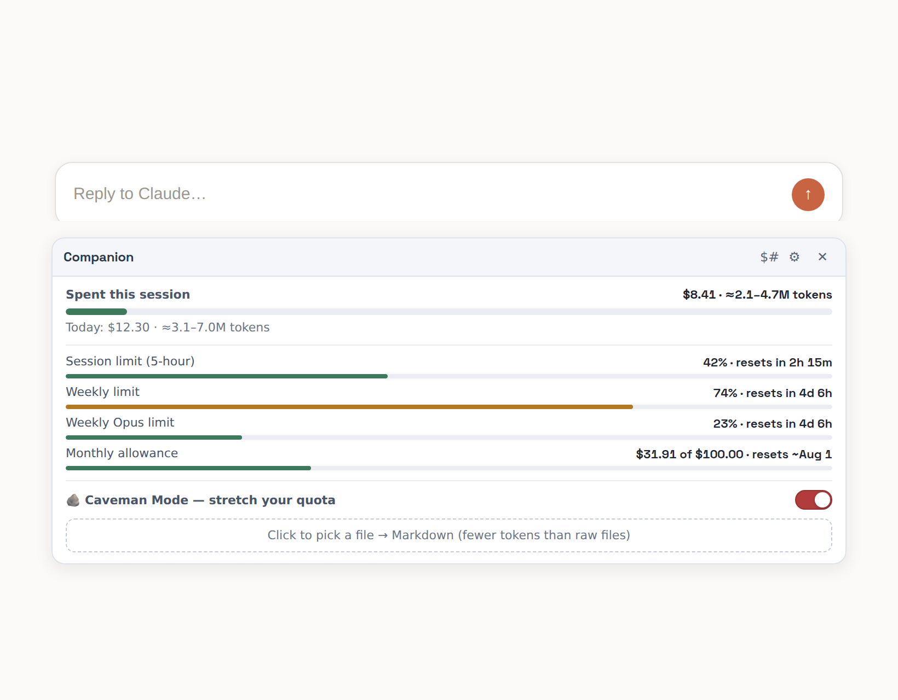
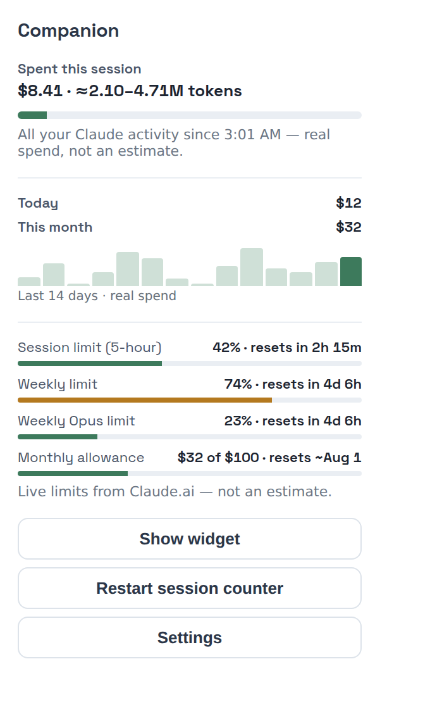
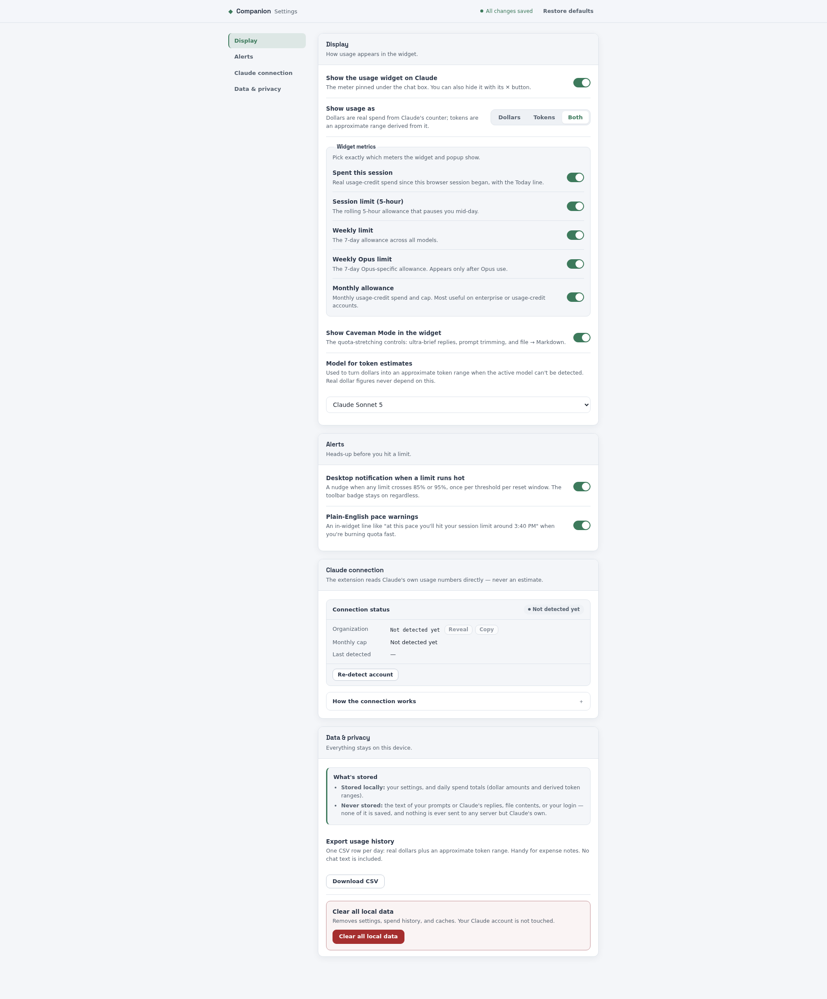

<div align="center">

<h1>Companion</h1>

<h3>An unofficial usage meter for Claude.ai — know exactly how much you're using, in <em>real dollars</em>, right under the chat box.</h3>

<p>No token-counting guesswork. No spreadsheets. No surprises when you hit a limit.</p>

<p>
  
  
  
  
</p>

<p>
  
  
  
  
</p>

<br/>

<picture>
  <source media="(prefers-color-scheme: dark)" srcset="docs/images/widget-dark.png">
  
</picture>

<br/>
<sub>The widget lives under the chat box — real spend up top, Claude's own limits below, Caveman Mode on tap.</sub>

</div>

---

> [!NOTE]
> **Every dollar figure is real.** It's read straight from Claude's own usage-credit counter — accurate to the cent, never estimated from text. Tokens are the only derived number, and they're shown as an honest range instead of fake precision.

## The Problem

Claude.ai tells you *almost* nothing about your usage until you slam into a limit mid-thought. Existing "token counter" extensions just **guess** — they scrape your text, estimate tokens, and multiply by a price they hope is right. The number is fiction, and it never matches reality.

## The Fix

Companion reads the **same numbers Claude's own settings page uses** and pins them under the chat box while you work:

- **Real spend**, to the cent — because it comes from Claude, not a guess.
- **Claude's actual limits** — 5-hour session, weekly, Opus, and monthly credits, each with a live reset countdown.
- **A heads-up before you hit the wall** — a badge and an optional desktop nudge at 85% / 95%.

---

## Features

| | |
|---|---|
| **Real-dollar tracking** | Session spend and daily spend sampled straight from Claude's own counter — not a token estimate. |
| **Claude's real limits** | Session (5-hour), weekly, Opus, and monthly-credit bars with reset countdowns, exactly as Claude reports them. |
| **Before-the-wall alerts** | Toolbar badge + optional desktop nudge when any limit runs hot, plus "at this pace you'll hit your limit around 3:40 PM". |
| **Caveman Mode** | Stretch your quota when it's running low — ultra-brief replies, local prompt-trimming, and file→Markdown. |
| **Only what you want** | Every meter is individually toggleable — session spend, each limit, monthly allowance, Caveman Mode — so the widget shows exactly the metrics you care about. |
| **Looks native** | Docks under the chat box, matches its width, and follows Claude's own light/dark theme. |
| **Private by design** | Your prompts and replies are never stored or sent anywhere. Read-only. No telemetry. |

---

## 📸 See It

<table>
<tr>
<td width="50%" valign="top" align="center">
<strong>Toolbar popup</strong><br/>
<picture>
  <source media="(prefers-color-scheme: dark)" srcset="docs/images/popup-dark.png">
  
</picture>
</td>
<td width="50%" valign="top" align="center">
<strong>Settings</strong><br/>
<picture>
  <source media="(prefers-color-scheme: dark)" srcset="docs/images/settings-dark.png">
  
</picture>
</td>
</tr>
</table>

---

## Caveman Mode — stretch your quota

Running low and need to squeeze out more work before the reset? Flip the red switch:

- **Brief replies** — Claude answers in the fewest words that fully resolve your request. Filler-free, never at the cost of substance.
- **Prompt trimming** — on send, a preview shows a *locally*-trimmed version of your prompt with the savings. Send it, edit it, or send the original — nothing is ever auto-sent, and it never rewrites your meaning.
- **File → Markdown** — drop in a PDF/DOCX/PPTX/XLSX/CSV and it's converted to lean Markdown *locally* (Claude ingests Markdown far more efficiently than a raw file).

Don't want it? One switch hides the whole feature.

---

## How it works

```
Claude's usage counter ──sample every ~60s──►  Session spend = now − when you opened your browser
        (real $, to the cent)                   Daily spend   = the counter's movement per day

Real dollars ──÷ blended price──►  ≈ token range   (shown as a range, because the real split is uncertain)
```

Dollars are ground truth. Tokens are the *only* derived value — and they're shown as `≈2.1–4.7M` rather than a single fake-precise number. The rolling limits come from Claude's own endpoint, unchanged.

## Security & privacy

Built to survive an IT/infosec review — the full write-up is in **[docs/SECURITY.md](docs/SECURITY.md)**. The short version:

- **Read-only.** No request the extension makes can change your account, chats, or settings.
- **Nothing leaves your device.** Prompts, replies, and file contents are never stored or transmitted. The extension only contacts Claude's own servers to read your usage. **Zero analytics or telemetry.**
- **Least privilege.** Access is scoped to `claude.ai` — no `<all_urls>`. Your session cookie is never read.
- **Sandboxed file parsing.** The third-party document parser runs in an opaque-origin sandbox with no `chrome.*` access and no network.

## ⚔️ vs. token-counting extensions

| | Token counters | **Companion** |
|---|:---:|:---:|
| Dollar amounts | 🤷 estimated from scraped text | ✅ **real, from Claude's counter** |
| Claude's actual limits | ❌ | ✅ session / weekly / Opus / monthly |
| Stores your prompts | ⚠️ often | ✅ **never** |
| Sends data to a server | ⚠️ sometimes | ✅ **never** |

---

## Quick start

1. `chrome://extensions` → enable **Developer mode** → **Load unpacked** → pick this folder.
2. Open **[claude.ai](https://claude.ai)** and sign in. The widget appears under the chat box. That's it.

Full walkthrough (settings tour, Caveman Mode, troubleshooting): **[docs/QUICKSTART.md](docs/QUICKSTART.md)**. Chrome Web Store availability is coming (submission in progress).

## Documentation

| | |
| --- | --- |
| 🚀 **[Quick Start](docs/QUICKSTART.md)** | Install, setup, and everyday use. |
| 🔒 **[Security & Privacy](docs/SECURITY.md)** | Architecture, data handling, permissions, threat model, audit steps. |
| 📝 **[Changelog](CHANGELOG.md)** | Version history. |

## FAQ

<details>
<summary><strong>Does it work on Free / Pro / Max / Team / Enterprise?</strong></summary>
<br/>
Yes. It reads whatever usage data your account exposes. Personal-plan users can hide the monthly-credit view in Settings for a cleaner look.
</details>

<details>
<summary><strong>Does it send my prompts or chats anywhere?</strong></summary>
<br/>
No. Prompt and reply text is never stored or transmitted. The extension only reads numeric usage from Claude's own endpoint. There is no analytics or telemetry of any kind.
</details>

<details>
<summary><strong>How accurate are the numbers?</strong></summary>
<br/>
Dollar figures are exact — they come straight from Claude's usage-credit counter. Tokens are the only estimate, and they're deliberately shown as a range because the real input/output/cache split isn't knowable client-side.
</details>

<details>
<summary><strong>Could this get my account flagged?</strong></summary>
<br/>
It only issues the same read-only requests Claude's own settings page makes, using your existing session — nothing that modifies your account. See <a href="docs/SECURITY.md">docs/SECURITY.md</a>.
</details>

<details>
<summary><strong>Is it really "real dollars" if I'm on a flat plan?</strong></summary>
<br/>
Yes — Claude meters your usage in credit-equivalent dollars under the hood, which is exactly what the counter reports. For flat plans it's the truest available measure of how much you're consuming; for usage-credit/overage billing it's your literal spend.
</details>

---

<div align="center">

**Built for people who think in budgets, not tokens.**

⭐ Star it if it saved you from hitting a limit mid-sentence.

<sub>Not affiliated with or endorsed by Anthropic. "Claude" is a trademark of Anthropic, PBC.</sub>

</div>
